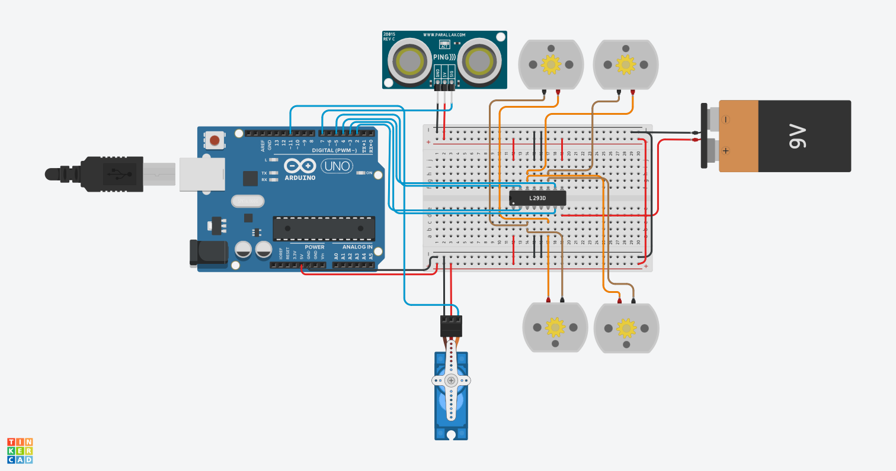

#  Arduino Smart Robot Controller (Combined Simulation Task)

##  Project Overview
This project is an advanced Arduino-based simulation developed using **Tinkercad**.

Although the assignment offered two individual options, this implementation **successfully combines both tasks into a single intelligent system**, providing complete motor motion control along with autonomous obstacle detection and avoidance.

---

##  Task Breakdown & Features

###  Task 1 Features: Timed Motion Logic
* **Forward Movement:** Drives all 4 DC Motors forward for **30 seconds**.
* **Backward Movement:** Reverses all 4 DC Motors for **1 minute (60 seconds)**.
* **Alternating Turns:** Alternates turning Right and Left sequentially for **1 minute (60 seconds)**.

###  Task 2 Features: Autonomous Obstacle Avoidance
* **Distance Sensing:** Uses an **Ultrasonic Distance Sensor** to continuously monitor the path ahead.
* **Safety Threshold:** If an obstacle is detected within **<= 10 cm**, the system immediately overrides the sequence and stops all motors.
* **Environment Scanning:** A **Servo Motor** rotates to scan the surroundings for safe clearance.
* **Path Rerouting:** Automatically reverses and turns to avoid collision before resuming normal operation.

---

##  Hardware Components

| Component | Quantity | Description |
| :--- | :---: | :--- |
| **Arduino Uno R3** | 1 | Main Microcontroller |
| **L293D Motor Driver IC** | 1 | Controls the 4 DC Motors (H-Bridge) |
| **DC Motors** | 4 | Robot Wheels Drive System |
| **Micro Servo Motor** | 1 | Rotates for Scanning (Connected to Pin 11) |
| **Ultrasonic Distance Sensor** | 1 | 3-pin Sensor for Obstacle Detection (Connected to Pin 7) |
| **9V Battery** | 1 | External Power Supply for Motors |

---

##  Circuit Pinout Connections

* **L293D Inputs (Motors Control):**
  * `IN1` -> Arduino **Pin 2**
  * `IN2` -> Arduino **Pin 3**
  * `IN3` -> Arduino **Pin 4**
  * `IN4` -> Arduino **Pin 5**
* **Ultrasonic Sensor (3-pin):**
  * `VCC` -> 5V | `GND` -> GND | `SIG` -> Arduino **Pin 7**
* **Servo Motor:**
  * `VCC` -> 5V | `GND` -> GND | `Signal` -> Arduino **Pin 11**

---

##  Tinkercad Simulation Link
You can view and test the live simulation here:
 **[Click Here to Open Tinkercad Simulation]([https://www.tinkercad.com](https://www.tinkercad.com/things/4NaONyVVSFK-daring-jaagub-juttuli/editel?returnTo=https%3A%2F%2Fwww.tinkercad.com%2Fdashboard&sharecode=3WMCm6FDr6pk6REj7p2dl_W5V5xeaEkpuKMsRT5ZZZw))**

---

##  Circuit Diagram

---

##  Source Code
The complete source code (`main.ino`) is included in this repository. It utilizes the `<Servo.h>` library and custom pulse logic to read distance from the 3-pin ultrasonic sensor.
